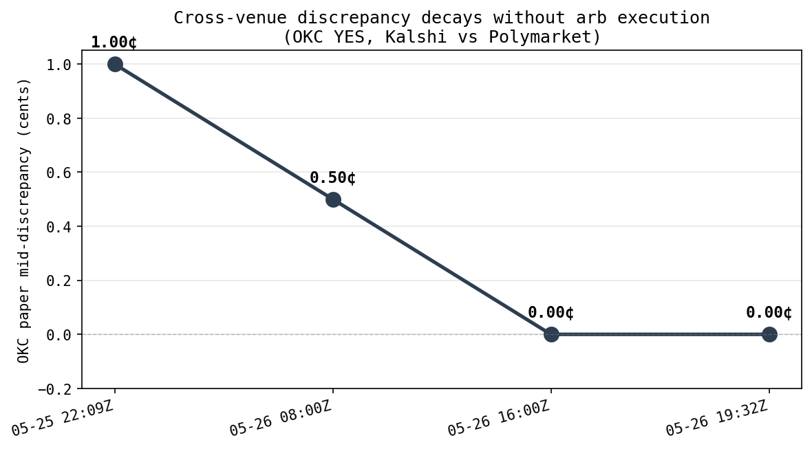
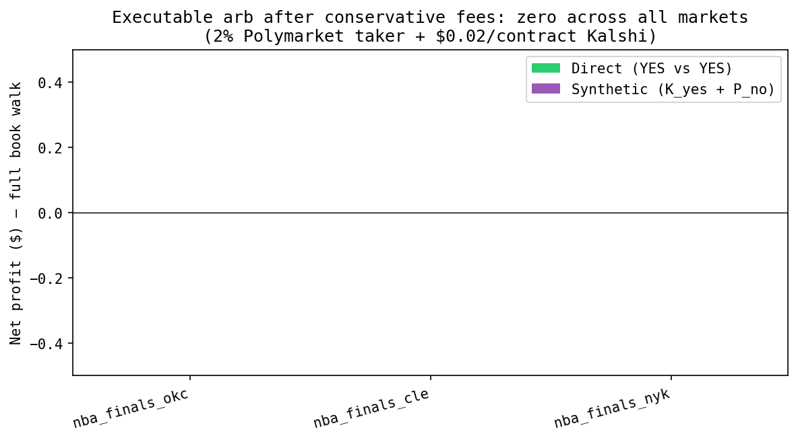

# kalshi-polymarket-microstructure-analysis

Empirical cross-venue microstructure analysis of prediction markets on Kalshi and Polymarket. The curated dataset spans 16 markets across NBA Finals, US Senate, international presidential elections (Colombia, Peru), US and international mayoral races, sports retirements, and M&A — a 5x expansion from the original three NBA Finals markets that anchored the initial study. A continuously-running 30-second poller has accumulated >14 hours of cross-venue orderbook history, with dense 5-second event-window capture armed for upcoming political catalysts. Stage 1 — characterization of the fee and execution surface — closes with the central finding that **no takeable cross-venue arbitrage exists at any accessible fee tier on either venue.** The artifact's value sits in observability and structural characterization, not in arbitrage capture.



## Stage-1 closure: no takeable cross-venue arb at any accessible fee tier

Under corrected fees calibrated to live per-market API rates (Kalshi parabolic `7¢ × C × (1−C)`, Polymarket category-dependent 3–4%), 0 of 15 computable markets show takeable arb at retail. Activating the Polymarket maker rebate adds no takeable markets. Direction-enforced execution modeling — distinguishing add-side legs (maker-eligible) from cross-side legs (taker-forced) — kills the original direction-blind "$30–$50" maker-scenario figures as category errors; the 8 markets with positive edge are *provideable* spread, not *takeable* arb, requiring resting passive and incoming flow. A counterfactual fee-tier sweep locates the cliff at ~0.30% taker / 0.20% maker rebate: at this tier 8 markets become genuinely takeable for ~$73/snapshot in a single fetch, and a 14.5-hour, 1,745-snapshot persistence sweep across the daemon's history confirms 5 PERSISTENT / 2 INTERMITTENT / 1 RARE / 0 snapshot-only across that subset, with the 6 variable markets largely uncorrelated (median |corr| 0.15) — independent edges, not one liquidity regime. External verification confirms neither venue offers this fee tier to any participant: the institutional and zero-fee scenarios are counterfactual. The persistence of NYK's $165 median crossed spread for 14 continuous hours is itself evidence that the displayed depth is not freely fillable — no actor with the modeled fee access exists, so the cross simply sits. The load-bearing remaining assumption is exclusive-fill at displayed depth; adverse selection and queue priority are not modeled.



The Stage-1 result was reached across three sub-builds (`docs/build_log.md` for the full record):
- **EXP-3a** corrected the project's flat-fee constants (`POLYMARKET_TAKER_FEE_RATE=0.02`, `KALSHI_PER_CONTRACT_FEE=0.02`) to per-market models pulled live from each venue's API, and added direction enforcement so maker fees apply only to legs the trade adds liquidity to.
- **EXP-3b** swept four fee tiers (retail, PM-rebate-active, institutional 0.30%/0.20%, zero-fee) on the direction-correct engine. The fee cliff is between retail and institutional; lowering fees below institutional adds no new markets because the remaining 7 are not crossed at the snapshot.
- **EXP-3c** measured persistence of the 8-market crossed subset across 1,745 snapshots from the running poller. 5 markets are crossed for the majority of the window; cross-market correlations are low.

## Additional findings

**Cross-venue prices converge observably without explicit arb.** The OKC market's paper discrepancy decayed from 1.00¢ → 0.50¢ → 0.00¢, then held at 0.00¢ across a second confirming snapshot, over ~22 hours total (see hero figure above). No executable arb fired during this period — paper edge never exceeded the fee threshold — yet the venues equilibrated to identical mids and stayed there. Market makers on at least one venue are paying attention to the other.

**Polymarket exhibits venue-specific responses to news shocks and resolution proximity.** The three NBA Finals championship-futures markets in the original dataset displayed three different Polymarket states by 2026-05-26: OKC YES remains a fully active book with both sides priced near the midpoint (~0.45) as the Thunder are mid-series in the Western Conference Finals; NYK YES has entered "lighthouse mode" — the book is structurally active (125+ bids, 90+ asks) but quotes have collapsed to the extremes (best_bid 0.001 / best_ask 0.999) following the Knicks' clinch of the Eastern Conference Finals earlier in the day; NYK NO and CLE YES return 404 from the CLOB — fully delisted (the Cavaliers were eliminated by the Knicks in the ECF). Kalshi by contrast maintains active books with substantial boundary-stub liquidity on all three markets (NYK YES alone has 4.65M contracts bid at $0.01 and 8.15M NO bids at $0.01) and does not appear to delist outcomes structurally; the venues exhibit different conventions for how to quote during news-driven repricing and post-elimination intervals.

**Three distinct microstructure regimes in three markets of the same event series.** OKC presents as a clean cross-venue match. NYK presents as a post-clinch repricing case: both venues are in temporary quote-collapse states as market-makers re-evaluate championship odds against TBD Finals opponents. Polymarket has parked quotes at boundary extremes (0.001/0.999); Kalshi maintains substantial boundary-stub liquidity at $0.01 on both sides. CLE presents as a post-elimination tail-probability case — Polymarket has fully delisted YES; Kalshi maintains a one-sided book with no YES bids at any price and a deep NO bid stack pricing the market at ~99.6% NO. Cross-venue spread asymmetries on tail-priced books were independently verified as tick-mechanical, not normalization artifacts: Kalshi's 1¢ minimum tick vs Polymarket's 0.1¢ effective tick produces a ~10× bps gap at low prices regardless of liquidity (`data/processed/spread_asymmetry_check.md`).

**The cross-venue universe is asymmetric.** Discovery across sports, macro/Fed, politics, and crypto categories surfaced bilateral high-volume markets in only one category natively (sports), with the expanded dataset deliberately reaching into international politics and M&A to test whether arb behavior is sports-specific (it is not — Stage 1 confirms the no-takeable-arb result holds across categories). Kalshi has Fed/election/weather markets without Polymarket equivalents; Polymarket has tail-event cultural markets without Kalshi equivalents. The asymmetry itself is a structural property of the current prediction-market landscape.

## Live forward theses

Two directions survive Stage-1 closure. Both are structurally different from arb-taking and neither requires institutional fee access.

**Thesis A — Liquidity provision.** Under direction-enforced maker execution, 8 markets show flow-contingent provideable spread, anchored by concrete per-contract magnitudes: arod +0.138¢ (mixed mode, K taker / PM maker), co_aesp +0.670¢ once the Polymarket 25% maker rebate is active, pe_rpal +1.171¢, kr_oseh +1.190¢, la_kbas +1.700¢, co_aesp +2.670¢ (both-maker). These are LP edges — captured by resting passive and waiting to be lifted by incoming taker flow, not by sweeping contra-venue depth. The relevant agent shape is market-making with inventory and fill risk, not arbitrage. Open empirical questions: fill realism (queue priority, adverse selection on lifts), inventory management across two venues with different settlement currencies (Kalshi USD vs Polymarket USDC-on-Polygon), and whether the PM maker rebate is reliably accruable in practice.

**Thesis B — Cross-venue latency / lead-lag.** Two independent observations point to Kalshi re-rating faster than Polymarket as new information arrives. First, the NYK market: post-ECF Game 6 (Knicks clinching, 2026-05-26), the bucket drifted mid_low → central → mid_low over ~36 hours, with the cross-venue mid-discrepancy reaching −0.95¢ Kalshi-richer at the D.2 snapshot, indicating Kalshi participants re-rated faster than Polymarket as Spurs/OKC information arrived. The May 31 Colombia presidential first-round count provides a second clean political-catalyst test on different markets in a different geography (dense 5-second capture armed for the 22:00 UTC → 06:00 UTC window). Edge in this thesis does not require fee-tier access — it requires being correctly positioned before the slower venue reprices, which is information advantage, not fee advantage.

**Closed:** the original cross-venue arb-as-taking-the-cross thesis.

## Dataset

Sixteen markets, cross-listed on Kalshi and Polymarket. Full mapping in `markets.yaml`; per-market fee metadata in `data/processed/market_fee_metadata.yaml`.

| Category | Markets |
|---|---|
| NBA Finals 2026 (championship futures) | OKC, NYK, SAS, CLE† |
| Sports retirement | Aaron Rodgers, Travis Kelce |
| US Senate (Alaska 2026 special) | Mpel |
| Colombia presidential 2026 (first round + R1 ticker) | AESP, PVAL, ICAS |
| Peru presidential 2026 | KFUJ, RPAL |
| Seoul mayoral 2026 (June 3 resolution) | OSEH |
| Los Angeles mayoral 2026 | KBAS, RHUA |
| M&A (Paramount / Warner Bros) | PSKY |

†CLE delisted on Polymarket post-Cavs-elimination (2026-05-26); retained in dataset with explicit `*_token_orderbook_status: "404_delisted"` markers, validated to exit cleanly. Combined open interest on the NBA Finals subset alone is ~$110M; cross-venue volume on the international elections subset is substantially deeper than initially expected.

Curated 2026-05-25 (NBA Finals); expanded 2026-05-27 via algorithmic discovery + manual curation against a stratification rubric (minimum $50K combined cross-venue OI, ≥48h to resolution, deliberate spread across probability buckets — see Build D in `docs/build_log.md`).

## Methodology

**Data sources.** Kalshi public market data (`/markets/{ticker}/orderbook` and `/series`, no auth). Polymarket CLOB (`get_order_book`, no auth) and Polymarket Gamma API (market metadata, pagination). Market discovery via `scripts/discover_markets.py` (Kalshi series enumeration + Polymarket active-market pull + rapidfuzz match scoring + semantic curation pass).

**Snapshots.** Per-venue orderbook snapshots taken via `scripts/fetch_snapshot.py`; cross-venue arb computed via `scripts/compute_arb.py [--fresh]`. Each fresh run auto-appends a ledger entry to `data/processed/snapshot_ledger.yaml` for provenance.

**Continuous polling.** A persistent 30-second daemon (`scripts/poll_timeofday.py`, supervised under `launchd`) polls all 16 markets on a single coherent compute path, dumping gzipped raw orderbooks to `data/raw/timeofday/` and a denormalized long-format CSV to `data/processed/timeofday_poll.csv` (gitignored — daemon output, not source of truth). Per-cycle null-row-on-failure resilience; tz-aware UTC timestamps throughout; CLE's expected 404s demoted from the real-error rate. Health check via `scripts/check_poll_health.py`. A parameterized event-window overlay (`scripts/poll_event_window.py`) provides 5-second dense capture during political catalysts.

**Normalization.** Kalshi's orderbook returns `yes_dollars` and `no_dollars` arrays (both bid-side). For comparability with Polymarket's two-token structure, both venues are normalized to a unified `NormalizedBook(bids, asks)` with asks reconstructed via complementarity (`ask_on_YES = 1 - bid_on_NO`). Reconstruction verified against Polymarket's directly-reported `yes_ask_dollars` to 4 decimals on every sampled book. See `src/pm_micro/normalize.py`.

**Microstructure metrics.** Per book: best bid/ask, simple and size-weighted mids, absolute and relative spread, depth at top-of-book, depth within ±1¢ and ±5¢ of mid, populated price-level counts. See `src/pm_micro/microstructure.py`.

**Fee model.** Fees are calibrated to live per-market API rates per venue, per execution mode, with direction enforcement. Kalshi follows a parabolic schedule (taker = `ceil(0.07 × C × (1−C) × 100) / 100` per contract; maker = 25% of taker for `quadratic_with_maker_fees` markets, $0 for `quadratic`-only markets). Polymarket fees are category-dependent (politics/tech 4%, sports 3%, etc.) with makers paying zero plus a 20–25% rebate of counterparty taker fees; no market in the current panel maps to the fee-free `world_events` category (verified per-market via the live `feeType` field). Direction-enforced: maker eligibility applies only to legs the trade adds liquidity to; legs that lift or cross resting depth pay taker regardless of execution mode. See `src/pm_micro/fees.py` and `src/pm_micro/arb.py`.

**Arb computation.** Three layers (paper mid-discrepancy, naive crossed-book, executable after fees) × two structures (direct, synthetic) × four fee tiers (retail / PM-rebate / institutional counterfactual / zero-fee counterfactual). Each computed market reports per-contract edge, executable $ (depth-aware walk), and a verdict in {takeable, provideable-fill-unconfirmed, $0}.

## Limitations

- **Two venues.** Findings are specific to the Kalshi × Polymarket pair. Other prediction-market venues (PredictIt, Manifold, intra-venue parlay surfaces) are out of scope.
- **Exclusive-fill assumption.** All executable-arb and LP-edge dollar figures assume the trader is the exclusive filler at displayed depth. Adverse selection (informed quotes), queue priority (resting orders ahead of the modeled trade), and fade-on-cross (quotes pulling on aggressive flow) are not modeled. This is the load-bearing remaining assumption — particularly for the LP-edge magnitudes in Thesis A and for the institutional-tier counterfactual.
- **Sub-snapshot latency not modeled.** The 30-second poll cadence resolves intraday patterns but not the microsecond-scale latency at which real cross-venue execution operates. Thesis B (lead-lag) requires websocket clients on both venues, which are not yet implemented.
- **Single observation window for the persistence sweep.** EXP-3c covers ~14.5 hours from a single calendar day. Weekly, day-of-week, and event-driven patterns are pending (the running daemon will provide multi-day coverage).

## Errata

This section documents a data-integrity bug discovered and corrected during the initial pre-publication verification. It is preserved here because the discovery process is itself part of the research record.

During Phase 2 curation (2026-05-25), the NYK entry in `markets.yaml` was populated from a truncated terminal screenshot. The Polymarket `condition_id`, `yes_token_id`, and `no_token_id` were each stored as 14-character literals ending in `...` (e.g., `"20257190540..."` rather than the full 77-character `"20257190540739490630509657713144742134547949967093643458458133445357169845406"`). This was missed in the Phase 2 validation step, which only verified that `yaml.safe_load` parsed without error and that orderbook fetches returned *something*.

As a result, every NYK Polymarket query from Phase 3 onward returned a 404 from the CLOB (Polymarket silently 404s on malformed token IDs rather than raising a distinct error). The initial Phase 5 writeup interpreted those 404s as Polymarket withdrawing liquidity from the NYK market. The actual cause was a malformed query; the NYK YES book was queryable throughout under the correct token ID. The bug was discovered on 2026-05-26 during a pre-email verification pass that re-fetched canonical token IDs via the Polymarket Gamma API and compared them against the stored values. `markets.yaml` was corrected (commit `e8ff31c`), `compute_arb.py --fresh` was re-run, and the figures were regenerated.

The methodological takeaway: cross-venue analysis on platforms that 404 on malformed identifiers requires explicit token-ID length validation at curation time. The expanded dataset's discovery pipeline (`scripts/discover_markets.py`) builds this in: every candidate token ID is validated `76 ≤ len ≤ 78 and isdigit()` before scoring, and `scripts/validate_markets_yaml.py` runs the same check on every committed entry.

A separate framing error in the original Phase 5 writeup characterized NYK's lighthouse-mode book as resulting from team elimination. This was corrected on 2026-05-26 after verification against the actual NBA playoff schedule: the Knicks were not eliminated — they had just clinched their NBA Finals appearance via a Game 6 ECF victory over the Cavaliers. The lighthouse-mode observation was real, but its cause was post-clinch news-shock repricing rather than post-elimination resolution-approach. The Cavaliers — eliminated by the Knicks — are the actual post-elimination market in the dataset, and the CLE finding (Polymarket fully delisted, Kalshi at tail probability) is correctly characterized.

A third correction (2026-05-28, via EXP-3a) re-characterized the Aaron Rodgers retirement market's edge profile, originally logged as a "depth-binds-before-fees" finding. The +5.85¢ figure was mid-discrepancy, not at-the-touch executable spread; the at-the-touch spread was ~1.1¢, which does not clear the corrected sports-taker round-trip fee floor. Depth-binds-before-fees only emerges under the Polymarket-maker scenario, where it correctly describes the constraint. See `docs/build_log.md` for the corrected build-D entry.

## Repo structure

src/pm_micro/         analysis library
clients/            thin venue clients (kalshi, polymarket)
fees.py             per-market fee models, direction enforcement
normalize.py        unified NormalizedBook with complementarity reconstruction
microstructure.py   spreads, depths, mids
arb.py              executable arb under direction-enforced fees
discovery.py        Kalshi series enumeration, rapidfuzz matching, ID validation
scripts/
fetch_snapshot.py             single-snapshot pipeline
compute_arb.py                arb compute on most recent snapshot
poll_timeofday.py             persistent 30s daemon (launchd-supervised)
poll_event_window.py          dense 5s event-window overlay
check_poll_health.py          daemon health verification
discover_markets.py           candidate discovery from Kalshi /series
curate_candidates.py          semantic match-type tagging
expand_markets_yaml.py        algorithmic + tiebreak picks
validate_markets_yaml.py      ID validation + venue reachability
fetch_market_fee_metadata.py  pull live per-market fee schedules
exp3a_fee_correction.py       direction-enforced fee re-run vs stale baseline
exp3b_fee_sweep.py            four-tier fee sensitivity
exp3c_persistence.py          1,745-snapshot crossed-frequency sweep
window_event.py               post-event lead-lag analysis (used post-catalyst)
notebooks/            pipeline validation, mapping, microstructure, cross-venue, writeup figures
data/raw/             timestamped orderbook snapshots (gitignored)
data/processed/       CSVs, figures, ledgers, build-output markdown
tests/                normalize, arb, fees unit tests (51 total, all green)
markets.yaml          curated 16-market cross-venue mapping
launchd/              poll daemon plist
docs/findings.md      prose narrative of findings
docs/build_log.md     append-only per-build record (Build D, EXP-3a/b/c, Stage-1 closure)


## Setup

```bash
uv sync
uv run pytest tests/ -v
uv run python scripts/fetch_snapshot.py
uv run python scripts/compute_arb.py --fresh
uv run python scripts/check_poll_health.py    # if daemon is running
uv run jupyter notebook notebooks/03_cross_venue.ipynb
```
