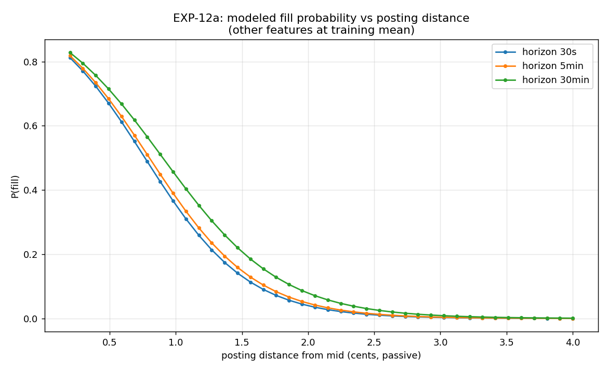
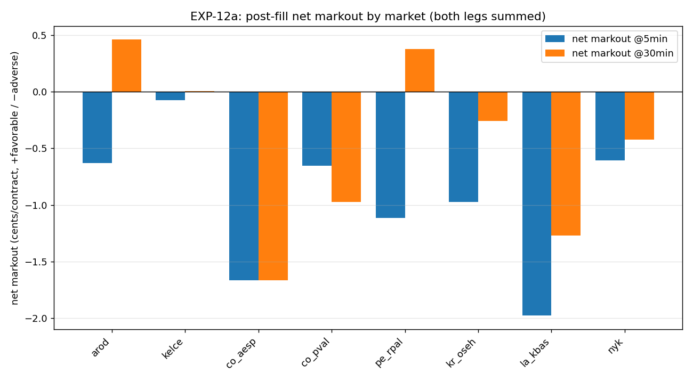

# EXP-12a Fill-Realism Modeling (8 LP-edge markets)

Replaces the load-bearing **exclusive-fill at displayed depth** assumption behind the EXP-3a/3b/3c LP-edge dollar figures with a probabilistic fill model + post-fill markout, calibrated on the full E.1 daemon history.

## Headline

Of the 8 LP-edge markets, **1 survive as REAL_EDGE** after fill-probability discounting and adverse-selection markout. Breakdown: 1 REAL_EDGE / 2 MARGINAL / 3 ADVERSE-SELECTED / 2 SUB-FILL.

**Most adverse-selected:** `la_kbas` (net 5min mean markout -1.979c/contract).

**Caution:** the REAL_EDGE verdict(s) — `co_aesp` — rest on very few genuine fill events in the window (markout n < 10), because these books are crossed only a small fraction of the time (see EXP-3c). The markout estimate is noisy; the survivor is provisional on more fill observations. **Every market's measured markout is negative**, so the direction of the adverse-selection effect is unambiguous even where its magnitude is uncertain.

**Bottom line:** adverse selection is pervasive — all 8 markets show negative net markout. The exclusive-fill LP figures from EXP-3a/3b/3c overstate realized edge by 1–2c/contract of adverse selection plus a fill-probability haircut. After both corrections, the LP thesis survives on at most one market (co_aesp, the widest gross edge) and only provisionally.

## Method

**Gross LP edge** (per contract): EXP-3a's direction-enforced both-maker scenario, recomputed from the D.2 snapshot + `fees.py` (so `nyk`, which entered via EXP-3b, is on the same footing). This is a single-instant spread.

**Fill probability**: logistic on `distance_c, queue_ahead, imbalance, vol_c, days_to_cat`, fit per horizon on the price-through proxy across all 8 markets × both venues × both sides × a passive distance grid. Evaluated at each market's median half-spread (its at-the-touch posting distance). Reported P(both legs fill) = P(buy)×P(sell) under an independence assumption (flagged).

**Markout** (adverse selection): for at-the-touch fills reconstructed over the window, the signed mid move (favorable-positive) at 30s / 5min / 30min, summed across the two legs (a hedged cross-venue pair nets directional moves, isolating venue-basis drift).

**Adjusted expected $/contract** = P(fill) × (gross_edge + markout):
- *optimistic*: markout = 0, fill @5min.
- *central*: fill @5min, markout @5min.
- *pessimistic*: fill @30min, markout @30min.

## Fill-probability model

| horizon | n train | base fill rate | top feature (|coef|) |
|---|---:|---:|---|
| 30s | 60,000 | 0.359 | distance_c (1.61) |
| 5min | 60,000 | 0.372 | distance_c (1.56) |
| 30min | 60,000 | 0.411 | distance_c (1.40) |

## Per-market: exclusive-fill $ → adjusted $

| market | gross c/ct | P(fill 5min) | net mean markout 5min | excl-fill $ | adj central $ | adj pessimistic $ | verdict |
|---|---:|---:|---:|---:|---:|---:|---|
| `arod` | +1.138 | 0.0% | -0.631c | $0.0114 | $0.0000 | $0.0000 | **SUB-FILL** |
| `kelce` | +0.221 | 33.2% | -0.075c | $0.0022 | $0.0005 | $0.0009 | **MARGINAL** |
| `co_aesp` | +2.670 | 33.9% | -1.667c | $0.0267 | $0.0034 | $0.0039 | **REAL_EDGE** |
| `co_pval` | +0.317 | 52.0% | -0.652c | $0.0032 | $-0.0017 | $-0.0035 | **ADVERSE-SELECTED** |
| `pe_rpal` | +1.171 | 55.1% | -1.114c | $0.0117 | $0.0003 | $0.0090 | **MARGINAL** |
| `kr_oseh` | +1.190 | 1.6% | -0.975c | $0.0119 | $0.0000 | $0.0003 | **SUB-FILL** |
| `la_kbas` | +1.700 | 32.9% | -1.979c | $0.0170 | $-0.0009 | $0.0016 | **ADVERSE-SELECTED** |
| `nyk` | -0.385 | 9.9% | -0.609c | $-0.0039 | $-0.0010 | $-0.0012 | **ADVERSE-SELECTED** |

*`excl-fill $` is the EXP-3a per-contract figure (gross edge, 100% fill, zero markout). `adj` columns apply this build's fill-probability and markout.*

## Per-market notes

- `arod` — **SUB-FILL**. Direction BUY kalshi@0.0400 / SELL polymarket@0.0510. Leg fill@5min: buy 64%, sell 0%. Leg mean markout@5min: buy +0.000c (nan% neg, n=0), sell -0.631c (65% neg, n=37); net median -0.250c. P(both fill @5min)=0.0% < 5%.
- `kelce` — **MARGINAL**. Direction BUY polymarket@0.0280 / SELL kalshi@0.0300. Leg fill@5min: buy 95%, sell 35%. Leg mean markout@5min: buy -0.075c (61% neg, n=18), sell +0.000c (nan% neg, n=0); net median -0.050c. positive but below real-edge floor after fill+markout.
- `co_aesp` — **REAL_EDGE**. Direction BUY polymarket@0.6700 / SELL kalshi@0.6900. Leg fill@5min: buy 59%, sell 57%. Leg mean markout@5min: buy -0.667c (67% neg, n=3), sell -1.000c (100% neg, n=1); net median -2.000c. survives fill discounting + markout [markout LOW-CONFIDENCE: only 4 genuine fill events in window — markout estimate noisy].
- `co_pval` — **ADVERSE-SELECTED**. Direction BUY polymarket@0.0170 / SELL kalshi@0.0200. Leg fill@5min: buy 80%, sell 65%. Leg mean markout@5min: buy -0.120c (73% neg, n=110), sell -0.532c (84% neg, n=31); net median -0.550c. markout (-0.652c) eats gross (+0.317c).
- `pe_rpal` — **MARGINAL**. Direction BUY polymarket@0.2710 / SELL kalshi@0.2800. Leg fill@5min: buy 85%, sell 64%. Leg mean markout@5min: buy -0.614c (94% neg, n=32), sell -0.500c (50% neg, n=2); net median -0.775c. positive but below real-edge floor after fill+markout.
- `kr_oseh` — **SUB-FILL**. Direction BUY kalshi@0.1800 / SELL polymarket@0.1900. Leg fill@5min: buy 3%, sell 57%. Leg mean markout@5min: buy -0.191c (32% neg, n=81), sell -0.784c (73% neg, n=37); net median -1.000c. P(both fill @5min)=1.6% < 5%.
- `la_kbas` — **ADVERSE-SELECTED**. Direction BUY kalshi@0.6900 / SELL polymarket@0.7000. Leg fill@5min: buy 60%, sell 55%. Leg mean markout@5min: buy -1.229c (92% neg, n=24), sell -0.750c (88% neg, n=8); net median -1.750c. markout (-1.979c) eats gross (+1.700c).
- `nyk` — **ADVERSE-SELECTED**. Direction BUY polymarket@0.2860 / SELL kalshi@0.2900. Leg fill@5min: buy 40%, sell 25%. Leg mean markout@5min: buy -0.147c (83% neg, n=18), sell -0.462c (85% neg, n=13); net median -0.675c. gross maker edge ≤0 before markout (maker-fee-bind: NBA Kalshi maker fee exceeds the 0.4c spread).

## Verdict definitions

- **REAL_EDGE** — P(both fill @5min) ≥ 5%, realized edge (gross + 5min markout) > 0, and central adjusted edge ≥ 0.05c/contract.
- **MARGINAL** — positive central adjusted edge but below the 0.05c/contract floor.
- **ADVERSE-SELECTED** — realized edge (gross + markout) ≤ 0: either markout eats a positive gross, or gross is already ≤0 (maker-fee-bind).
- **SUB-FILL** — P(both fill @5min) below 5%; expected $ ≈ 0 regardless of edge sign.

## Caveats

1. **30s resolution.** Fills are reconstructed from a price-through proxy on 30-second snapshots, not tick data. We observe that price reached a level, not the actual queue dynamics. Intra-snapshot fills, partial fills, and fleeting quotes are invisible.
2. **Queue-depletion proxy.** We assume the queue ahead clears proportionally when price touches a level. This OVER-counts fills for at-the-touch posting (you sit behind existing queue), so the P(fill) figures are an upper bound; markout is the disciplining diagnostic.
3. **Leg-fill independence.** P(both fill) = P(buy)×P(sell) assumes the two legs' fills are independent. In a directional move both legs may fill together (correlated), which would raise joint fill probability but also co-move markout — the net effect on expected $ is ambiguous and unmodeled.
4. **No F.1 dense data.** Calibration uses only the 30s E.1 time-of-day history. The F.1 event-window dense captures (Colombia 1st round May 31, Seoul June 3) are not yet folded in; near-catalyst fill/markout behavior may differ materially.
5. **Markout horizon ≠ hedge latency.** Markout at 5/30min measures information decay, not the actual time to hedge the second leg. A faster hedger eats less adverse selection than the 5min figure implies; a slower one eats more.
