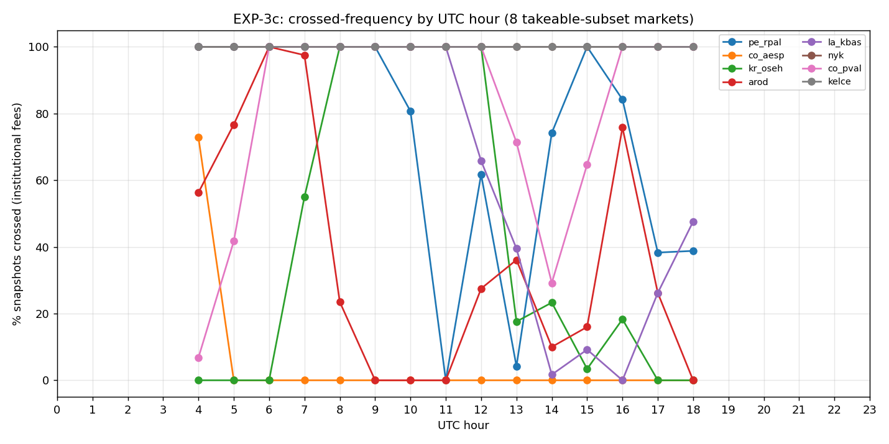
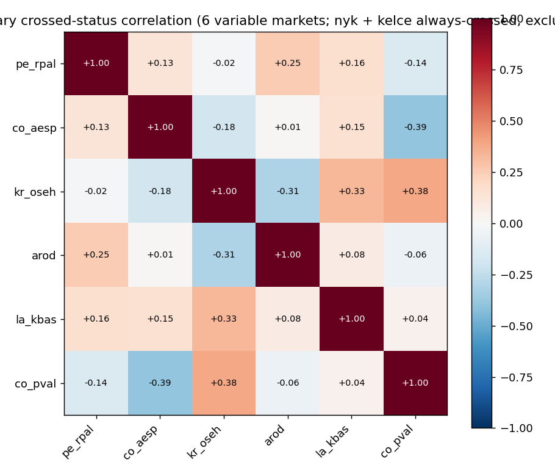

# EXP-3c Multi-Snapshot Persistence

**Daemon history:** `data/raw/timeofday/` — 13,984 (snapshot × market) records across the 8 EXP-3b takeable-subset markets; 0 fetch errors excluded.  
**Snapshot groups (distinct UTC timestamps with all 8 books present):** 1,748.  
**Fee tier:** institutional (0.30% taker flat, both venues).  
**Engine:** `compute_executable_arb_direct` with the `_InstitutionalCtx` from EXP-3b; identical direction-enforced take-take walker.

## Headline numbers

* **% snapshots with ≥1 market crossed:** 100.0%
* **Median total takeable $ when something is crossed:** $190.82
* **Mean total takeable $ when something is crossed:** $189.72
* **Max single-snapshot total takeable $:** $407.48
* **Median total *excluding* nyk** (which dominates and may reflect a structural dislocation, see below): $17.45 on 100.0% of snapshots.

## Per-market persistence

| market | n snaps | % crossed | median $ when crossed | max $ | median paper c | longest crossed run | longest uncrossed gap | verdict |
|---|---:|---:|---:|---:|---:|---:|---:|---|
| `pe_rpal` | 1,748 | 72.4% | $13.62 | $49.12 | 0.70c | 398.5 min | 94.0 min | **PERSISTENT** |
| `co_aesp` | 1,748 | 4.3% | $1.10 | $8.21 | 2.00c | 37.5 min | 836.5 min | **RARE** |
| `kr_oseh` | 1,748 | 42.3% | $9.26 | $12.33 | 2.00c | 341.5 min | 196.0 min | **INTERMITTENT** |
| `arod` | 1,748 | 36.6% | $2.40 | $4.74 | 1.20c | 98.5 min | 249.0 min | **INTERMITTENT** |
| `la_kbas` | 1,748 | 66.1% | $0.81 | $25.18 | 1.00c | 508.5 min | 119.5 min | **PERSISTENT** |
| `nyk` | 1,748 | 100.0% | $165.89 | $406.35 | 0.50c | 874.0 min | 0.0 min | **PERSISTENT** |
| `co_pval` | 1,748 | 81.3% | $0.94 | $4.58 | 0.60c | 458.0 min | 64.5 min | **PERSISTENT** |
| `kelce` | 1,748 | 100.0% | $0.71 | $0.96 | 0.30c | 874.0 min | 0.0 min | **PERSISTENT** |

*Verdict thresholds: PERSISTENT ≥50%, INTERMITTENT 10–50%, RARE <10% (>0%), SNAPSHOT-ONLY 0%. Daemon cadence is 30s, so the longest-run columns are in 30-second steps (×0.5 min).

## Time-of-day pattern (% crossed by UTC hour)

| hour | `pe_rpal`  |  `co_aesp`  |  `kr_oseh`  |  `arod`  |  `la_kbas`  |  `nyk`  |  `co_pval`  |  `kelce`  |
|---|---|---|---|---|---|---|---|---|
| 04Z | 100.0% | 72.8% | 0.0% | 56.3% | 100.0% | 100.0% | 6.8% | 100.0% |
| 05Z | 100.0% | 0.0% | 0.0% | 76.7% | 100.0% | 100.0% | 41.7% | 100.0% |
| 06Z | 100.0% | 0.0% | 0.0% | 100.0% | 100.0% | 100.0% | 100.0% | 100.0% |
| 07Z | 100.0% | 0.0% | 55.0% | 97.5% | 100.0% | 100.0% | 100.0% | 100.0% |
| 08Z | 100.0% | 0.0% | 100.0% | 23.5% | 100.0% | 100.0% | 100.0% | 100.0% |
| 09Z | 100.0% | 0.0% | 100.0% | 0.0% | 100.0% | 100.0% | 100.0% | 100.0% |
| 10Z | 80.7% | 0.0% | 100.0% | 0.0% | 100.0% | 100.0% | 100.0% | 100.0% |
| 11Z | 0.0% | 0.0% | 100.0% | 0.0% | 100.0% | 100.0% | 100.0% | 100.0% |
| 12Z | 61.7% | 0.0% | 100.0% | 27.5% | 65.8% | 100.0% | 100.0% | 100.0% |
| 13Z | 4.2% | 0.0% | 17.6% | 36.1% | 39.5% | 100.0% | 71.4% | 100.0% |
| 14Z | 74.2% | 0.0% | 23.3% | 10.0% | 1.7% | 100.0% | 29.2% | 100.0% |
| 15Z | 100.0% | 0.0% | 3.4% | 16.0% | 9.2% | 100.0% | 64.7% | 100.0% |
| 16Z | 84.2% | 0.0% | 18.3% | 75.8% | 0.0% | 100.0% | 100.0% | 100.0% |
| 17Z | 38.3% | 0.0% | 0.0% | 26.2% | 26.2% | 100.0% | 100.0% | 100.0% |
| 18Z | 38.8% | 0.0% | 0.0% | 0.0% | 47.6% | 100.0% | 100.0% | 100.0% |

## Cross-market binary correlation

**Always-crossed markets (zero variance, omitted from corr matrix):** `nyk`, `kelce`. Pearson is undefined when a series is constant; their behavior is itself the finding (perpetual crossing).

Binary Pearson correlation of `is_crossed` (1/0) per snapshot across the 6 variable-status markets:

| | `pe_rpal` | `co_aesp` | `kr_oseh` | `arod` | `la_kbas` | `co_pval` |
|---|---|---|---|---|---|---|
| `pe_rpal` | +1.00 | +0.13 | -0.02 | +0.25 | +0.16 | -0.14 |
| `co_aesp` | +0.13 | +1.00 | -0.18 | +0.01 | +0.15 | -0.39 |
| `kr_oseh` | -0.02 | -0.18 | +1.00 | -0.31 | +0.33 | +0.38 |
| `arod` | +0.25 | +0.01 | -0.31 | +1.00 | +0.08 | -0.06 |
| `la_kbas` | +0.16 | +0.15 | +0.33 | +0.08 | +1.00 | +0.04 |
| `co_pval` | -0.14 | -0.39 | +0.38 | -0.06 | +0.04 | +1.00 |

*Interpretation: correlation > +0.5 indicates 'crossed at the same time' (one liquidity regime); ~0 indicates independent crossing; negative values indicate anti-correlated regimes.

## Interpretation

**Crossing is the norm, not the exception, at the institutional fee tier.** Across the daemon window, 100.0% of snapshots have at least one of the 8 markets crossed; when any is crossed the median total takeable is $190.82. **`nyk` alone drives most of this** — excluding nyk, the median when anything else is crossed is $17.45 (on 100.0% of snapshots). nyk and kelce are always-crossed throughout the daemon window, suggesting they sit in a structurally crossed regime (NBA Finals + Travis Kelce retirement; both have wide K ticks relative to fine PM ticks) rather than transient flow events. Even modest persistent crossings would be expected to be arbed out by any real institutional arbitrageur in seconds; that they persist for 14+ hours strongly suggests either (a) no actor on either venue has the 0.30%/0.20% access we modeled, or (b) the resting orders are informed and lifting them is adversely selected (see caveat 5).

**Per-market split:** 5 PERSISTENT (`pe_rpal`, `la_kbas`, `nyk`, `co_pval`, `kelce`); 2 INTERMITTENT (`kr_oseh`, `arod`); 1 RARE (`co_aesp`); 0 SNAPSHOT-ONLY (—).

**Correlation:** median |corr| across 15 distinct pairs (excluding the always-crossed `nyk`/`kelce`) = 0.15. Markets cross **independently** (low pairwise correlation): this is 8 separate edges, not one liquidity regime.

Top positively-correlated pairs (crossed together): `kr_oseh`↔`co_pval` (+0.38), `kr_oseh`↔`la_kbas` (+0.33), `pe_rpal`↔`arod` (+0.25).

Top anti-correlated pairs: `co_aesp`↔`co_pval` (-0.39), `kr_oseh`↔`arod` (-0.31), `co_aesp`↔`kr_oseh` (-0.18).

**Time-of-day:** see figure. The daemon's first observed hour is 04Z (start of run); hours 00–03Z are unobserved in this window. Sustained crossing during business-day hours in the primary venue's home tz (Polymarket → US, Kalshi → US) would indicate flow-driven dislocation; uniform crossing would indicate structural (not flow) crossedness.

## Caveats

1. **Daemon window only.** Data spans the E.1 daemon's continuous run window (~2026-05-28T04:00Z onward, ~14 hours at the time of this run). Frequencies are conditional on that window; they are not lifetime market statistics.
2. **Single-day.** All snapshots fall within one UTC date; day-of-week / weekend effects are unobserved.
3. **Institutional tier is counterfactual** (same caveat as EXP-3b). At retail fees, every count above would be 0 — that's the EXP-3a/3b finding.
4. **Exclusive-fill assumption.** Dollar figures assume the first arbitrageur to fire gets the full resting depth on both venues. Queue position, latency, and competition are not modeled. Real PnL would be a fraction of the headline.
5. **Adverse selection.** If a takeable cross persists for minutes (see longest-run column), that's evidence the resting orders may be informed quotes — the contra-side hasn't been lifted by other arbitrageurs because, perhaps, the fill would be toxic. The 'persistent' verdicts should be read with this in mind: long persistence ≠ free money.
